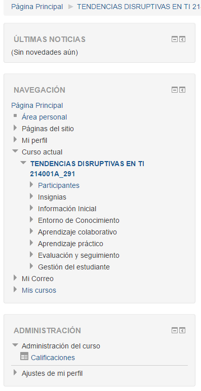
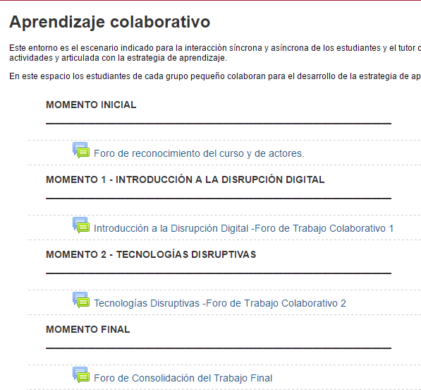

# Manual

Pantallazo inicial donde nos encontramos cuando entramos a la plataforma
Lado izquierdo un menu en el cual nos permitira entrar directamente en la opcion que necesitamos el central por otro lado nos permite ingresar a las mismas opciones pero de una manera mas didactica.
El menide la izquierda nos indica un calendario con las actividades a realizar

Este menu nos permite ver y navegar por los diferentes entornos de la plataforma

Menu central

Calendario donde nos indica fechas para entrega de actividades junto ocn eventos proximos

Información Inicial
Este entorno nos permite  tener un espacio de participacion donde se dan noticias del curso se participa en los foros para solucionar inquietudes.

Entorno de Conocimiento
En este entorno se encuentran las actividades a realizar junto con los modos de calificacion e documentacion sobre el curso

Aprendizaje colaborativo
Este entorno permite la interacción de los estudiantes y el tutor, son grupos pequeños los cuales realizan las actividades planteadas. 

Aprendizaje práctico
Este entorno está creado para concretar teorías aplicándolas a situaciones problemáticas reales. 

Evaluación y seguimiento

Este entorno esta dispuesto para el proceso de evaluación el cual indica las calificaciones de los estudiantes 

